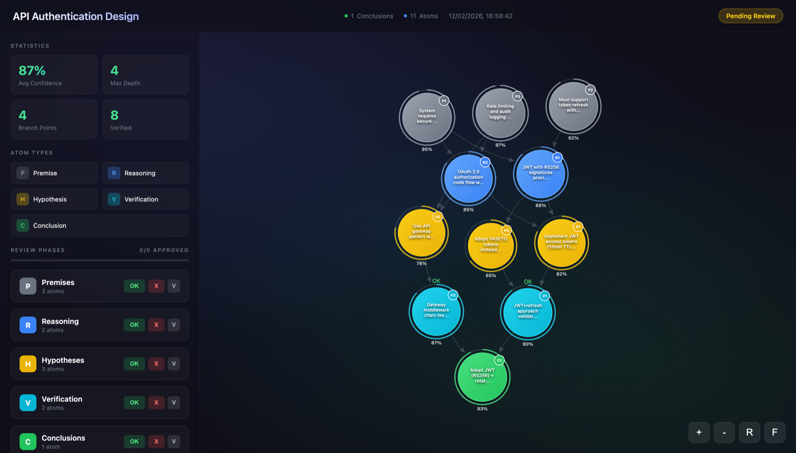

<div align="center">

# Atom of Thoughts

Structured reasoning for LLMs. Decompose → track confidence → visualize.

[](https://www.npmjs.com/package/@dioptx/mcp-atom-of-thoughts)
[](LICENSE)
[](package.json)
[](#development)
[](tsconfig.json)



</div>

---

## Setup

Add to your MCP config:

```json
{
  "mcpServers": {
    "atom-of-thoughts": {
      "command": "npx",
      "args": ["-y", "@dioptx/mcp-atom-of-thoughts"]
    }
  }
}
```

> [!TIP]
> Works with Claude Code, Cursor, Windsurf, or any MCP client.

## How it works


Atoms depend on each other, carry confidence scores (0–1), and auto-terminate when a high-confidence conclusion is reached or max depth is hit.

## Tools

Three tools, decided by what you're doing:

| Tool | Use for |
|------|---------|
| `AoT-fast` | Default reasoning — depth 3, auto-suggests conclusions, fits most tasks |
| `AoT-full` | Deep reasoning with decomposition-contraction — depth 5, sub-atoms verified independently |
| `atomcommands` | Lifecycle and meta ops: sessions, decomposition control, export, approval polling |

Set `viz: true` on any AoT call when the user is reviewing your reasoning or you're in planning mode. The graph opens in the browser and approve/reject clicks POST back to the MCP server in-process — no filesystem polling.

---

<details>
<summary><b>Configuration</b></summary>

Pass flags via `args` to change behavior:

```json
{
  "args": ["-y", "@dioptx/mcp-atom-of-thoughts", "--mode", "fast", "--viz", "never"]
}
```

| Flag | Default | What it does |
|------|---------|--------------|
| `--mode full\|fast\|both` | `both` | Which AoT tools to register |
| `--viz auto\|always\|never` | `auto` | `auto` renders only when call sets `viz:true`; `always` renders every call; `never` ignores the param (CI/headless) |
| `--max-depth <n>` | 5 / 3 | Override reasoning depth limit |
| `--output-dir <path>` | OS temp | Where to write visualization HTML |
| `--downloads-dir <path>` | ~/Downloads | Fallback dir for approval JSON if HTTP callback can't bind |

</details>

<details>
<summary><b>Sessions</b></summary>

Each reasoning problem lives in its own session so atoms don't leak between problems in a long-running MCP process.

- Default session is `"default"` and is created at startup.
- AoT calls accept an optional `sessionId` to target a specific session (auto-creates if unknown).
- `atomcommands` exposes `new_session`, `switch_session`, `list_sessions`, `reset_session`.
- When reasoning terminates (max depth or strong conclusion), the session is auto-archived as `completed`.
- The next zero-dependency atom with no explicit `sessionId` auto-spawns a fresh `default-N` — so you don't have to manage sessions explicitly across problems.

Every `processAtom` response includes `sessionId` so you always know what's being written to.

</details>

<details>
<summary><b>Visualization & Approval</b></summary>

`viz: true` on an AoT call generates a self-contained HTML file (D3 bundled inline — works offline) and opens it in your browser. The UI shows:

- Force-directed graph of all atoms and their dependencies
- Color-coded nodes by type with confidence rings
- Sidebar to approve/reject each phase or individual atom

When you click approve/reject, the browser POSTs the decision back to a local 127.0.0.1 listener the MCP server runs on an ephemeral port. `atomcommands` `check_approval` reads the in-memory store keyed by session — no filesystem polling, no `~/Downloads` dump.

If the listener can't bind (rare — locked-down corp machine), the browser falls back to a file download in `~/Downloads` and `check_approval` falls back to scanning that dir.

</details>

<details>
<summary><b>Install Methods</b></summary>

**npx (recommended — zero install):**
```json
{ "command": "npx", "args": ["-y", "@dioptx/mcp-atom-of-thoughts"] }
```

**npm global:**
```bash
npm install -g @dioptx/mcp-atom-of-thoughts
```
```json
{ "command": "mcp-atom-of-thoughts" }
```

**Smithery:**
```bash
npx -y @smithery/cli install @dioptx/mcp-atom-of-thoughts --client claude
```

**Docker:**
```bash
docker build -t aot .
```
```json
{ "command": "docker", "args": ["run", "-i", "--rm", "aot"] }
```

</details>

<details>
<summary><b>Development</b></summary>

```bash
git clone https://github.com/dioptx/mcp-atom-of-thoughts.git
cd mcp-atom-of-thoughts
npm install
npm test        # 165 tests
npm run build
```

</details>

---

MIT · Based on [Atom of Thoughts](https://arxiv.org/abs/2502.12018)
