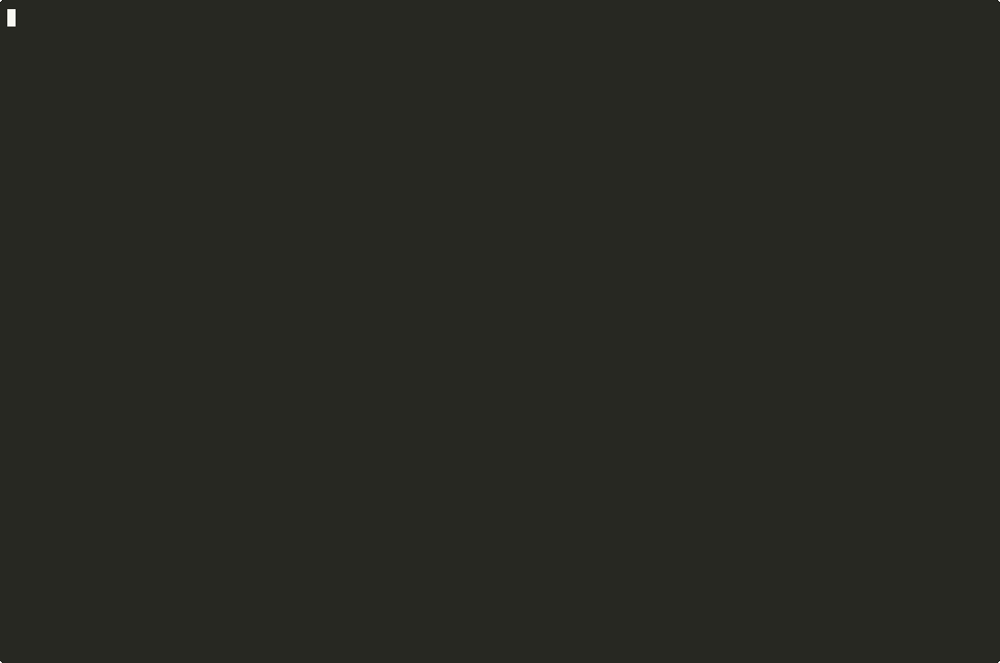

<div align="center">

# Atom of Thoughts

Structured reasoning for LLMs. Decompose, track confidence, visualize, approve.

[](https://www.npmjs.com/package/@dioptx/mcp-atom-of-thoughts)
[](LICENSE)
[](package.json)
[](#development)
[](tsconfig.json)



</div>

---

## Quickstart

**1.** Add to your MCP config:

```json
{
  "mcpServers": {
    "atom-of-thoughts": {
      "command": "npx",
      "args": ["-y", "@dioptx/mcp-atom-of-thoughts"]
    }
  }
}
```

**2.** Restart your client.

**3.** Ask the model to reason something through:

> *"Use AoT-fast to think through whether we should use JWT or session-based auth for the API."*

The model breaks the problem into five kinds of atoms (premise, reasoning, hypothesis, verification, conclusion), each tagged with a confidence score. You get a structured chain you can audit, not a black-box answer.

> [!TIP]
> Works with Claude Code, Cursor, Windsurf, or any MCP-aware client.

## Install

**npx** *(recommended; zero install, always latest)*
```json
{ "command": "npx", "args": ["-y", "@dioptx/mcp-atom-of-thoughts"] }
```

**npm global**
```bash
npm install -g @dioptx/mcp-atom-of-thoughts
```
```json
{ "command": "mcp-atom-of-thoughts" }
```

**Smithery**
```bash
npx -y @smithery/cli install @dioptx/mcp-atom-of-thoughts --client claude
```

**Docker**
```bash
docker build -t aot .
```
```json
{ "command": "docker", "args": ["run", "-i", "--rm", "aot"] }
```

## How it works


Atoms chain through dependencies. Each carries a confidence score from 0 to 1. Reasoning terminates when a high-confidence conclusion lands or max depth is hit. Each problem runs in its own session, so two threads of thought never bleed into each other.

## Tools

Three tools cover the full surface:

| Tool | When to reach for it |
|------|---------------------|
| **`AoT-fast`** | Default. Tradeoffs, debugging, decisions, option evaluation. Depth 3. |
| **`AoT-full`** | Plans, architecture, decomposition into sub-problems. Depth 5. |
| **`atomcommands`** | Sessions, export, approval polling, decomposition lifecycle. |

### Quick example

```
AoT-fast({atomId:"P1", content:"API returns 500 on POST /users",     atomType:"premise"})
AoT-fast({atomId:"R1", content:"Unhandled exception in route handler", atomType:"reasoning", dependencies:["P1"]})
AoT-fast({atomId:"C1", content:"Add try-catch in POST handler",       atomType:"conclusion", dependencies:["R1"], confidence:0.9})
```

Only `atomId`, `content`, and `atomType` are required. Everything else has sensible defaults.

### Visualization

Pass `viz: true` on any call to open an interactive D3 graph in the browser:

```
AoT-fast({atomId:"C1", ..., viz: true})
```

Approve and reject decisions POST back to the server over HTTP. No filesystem polling.

## Live TUI

Watch the model reason in a second terminal pane while it works, and feed approve/reject decisions back into the next tool call. The event feed is on by default; nothing extra to configure.

In a second pane next to your LLM client:

```bash
npx -y @dioptx/mcp-atom-of-thoughts tui
```

### 1. Watch reasoning unfold


Atoms appear as the model emits them, walking the chain premise → reasoning → hypothesis → verification → conclusion. Confidence bars fill in real time, dependencies show as inline arrows, and a velocity sparkline tracks event rate. Auto-scroll keeps the newest atom selected.

### 2. Give granular feedback


`j` / `k` move the selection. `a` accepts an atom; `*` stars it as critical context; `r` rejects it and prompts for a one-line reason. `s` submits the verdict. The submit flash tells you exactly what to do next: ask the model to call `atomcommands check_approval`. The verdict is written as the same approval JSON the existing file-fallback path already polls for, so feedback flows back through a contract the server already understands. **Zero new wire protocol.**

### 3. Customize the view


`t` opens settings: confidence threshold to hide low-confidence atoms, color theme (vibrant, soft, or mono), compact mode, dependency arrows toggle. `?` shows the full keymap.

### Keys reference

| Key | Action |
|-----|--------|
| `j` / `k` | Move selection |
| `a` | Accept the selected atom |
| `r` | Reject (prompts for a one-line reason) |
| `u` | Clear feedback on the selected atom |
| `*` | Star as critical context |
| `s` | Submit verdict (writes `aot-approval-*.json`) |
| `t` | Settings (threshold, theme, compact mode, deps) |
| `?` | Keys help |
| `space` | Pause / resume event stream |
| `q` | Quit |

> [!TIP]
> Skip setup and see it in action: `npx -y @dioptx/mcp-atom-of-thoughts tui --demo`

---

<details>
<summary><b>Configuration</b></summary>

```json
{
  "args": ["-y", "@dioptx/mcp-atom-of-thoughts", "--mode", "fast", "--viz", "never"]
}
```

| Flag | Default | Effect |
|------|---------|--------|
| `--mode full\|fast\|both` | `both` | Which tools to register |
| `--viz auto\|always\|never` | `auto` | `auto`: render on `viz:true`. `always`: render every call. `never`: skip (CI) |
| `--max-depth <n>` | 5 / 3 | Override depth limit |
| `--output-dir <path>` | OS temp | Where to write viz HTML |
| `--downloads-dir <path>` | ~/Downloads | Approval JSON fallback |

</details>

<details>
<summary><b>Sessions</b></summary>

Each reasoning chain gets its own session. Default ID: `"default"`.

- `atomcommands new_session` creates and activates a new one.
- `atomcommands switch_session` / `list_sessions` / `reset_session` for management.
- When reasoning terminates, the session auto-archives. The next zero-dependency atom auto-spawns `default-2`, `default-3`, and so on.
- Or pass `sessionId` on any AoT call to target one explicitly.

Two problems in one MCP process stay isolated without manual session management.

</details>

<details>
<summary><b>Browser visualization (alternative to the TUI)</b></summary>

Prefer a browser tab to a terminal pane? Pass `viz: true` on any AoT call. The server writes a self-contained HTML file (D3 inlined, works offline) and opens it:

- Force-directed graph colored by atom type with confidence rings
- Sidebar to approve or reject phases or individual atoms
- Approve / reject POSTs to a local `127.0.0.1` listener on an ephemeral port; falls back to a `~/Downloads` file scan if the listener can't bind

The TUI and the browser viz both feed `atomcommands check_approval`. Pick whichever fits your workflow.

</details>

<details>
<summary><b>Install methods</b></summary>

**npx** (zero install):
```json
{ "command": "npx", "args": ["-y", "@dioptx/mcp-atom-of-thoughts"] }
```

**npm global**:
```bash
npm install -g @dioptx/mcp-atom-of-thoughts
```

**Smithery**:
```bash
npx -y @smithery/cli install @dioptx/mcp-atom-of-thoughts --client claude
```

**Docker**:
```bash
docker build -t aot . && docker run -i --rm aot
```

</details>

<details>
<summary><b>Development</b></summary>

```bash
git clone https://github.com/dioptx/mcp-atom-of-thoughts.git
cd mcp-atom-of-thoughts
npm install
npm test        # 183 tests (unit + e2e)
npm run build
```

</details>

<details>
<summary><b>Migrating from v2</b></summary>

See [`MIGRATION_v2_to_v3.md`](MIGRATION_v2_to_v3.md) for the full lookup table. The short version:

- `AoT-light` is now `AoT-fast`
- `AoT` is now `AoT-full`
- `generate_visualization` is now `viz: true` on any AoT call
- `export_graph` and `check_approval` are now `atomcommands` subcommands
- `--no-viz` and `--no-approval` are replaced by `--viz auto|always|never`

</details>

---

MIT. Based on [Atom of Thoughts](https://arxiv.org/abs/2502.12018).
